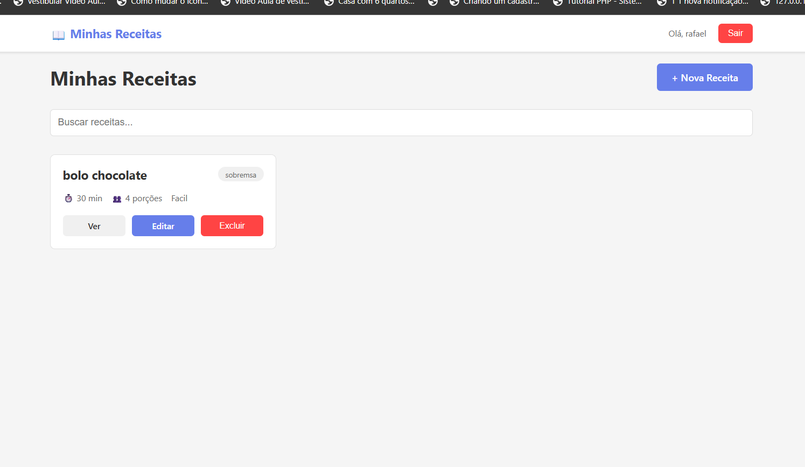

# Front-end - Desafio A4PM



## 📋 Pré-requisitos

- Node.js
- Docker e Docker Compose

## 🚀 Como executar

```bash
npm install
docker compose up
```

A aplicação estará disponível em: **http://localhost:5173**
